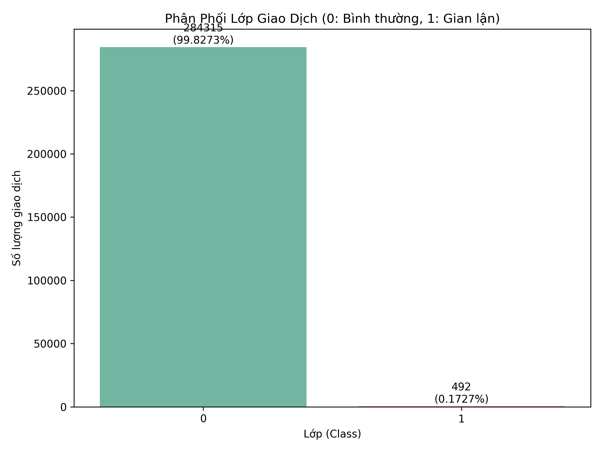
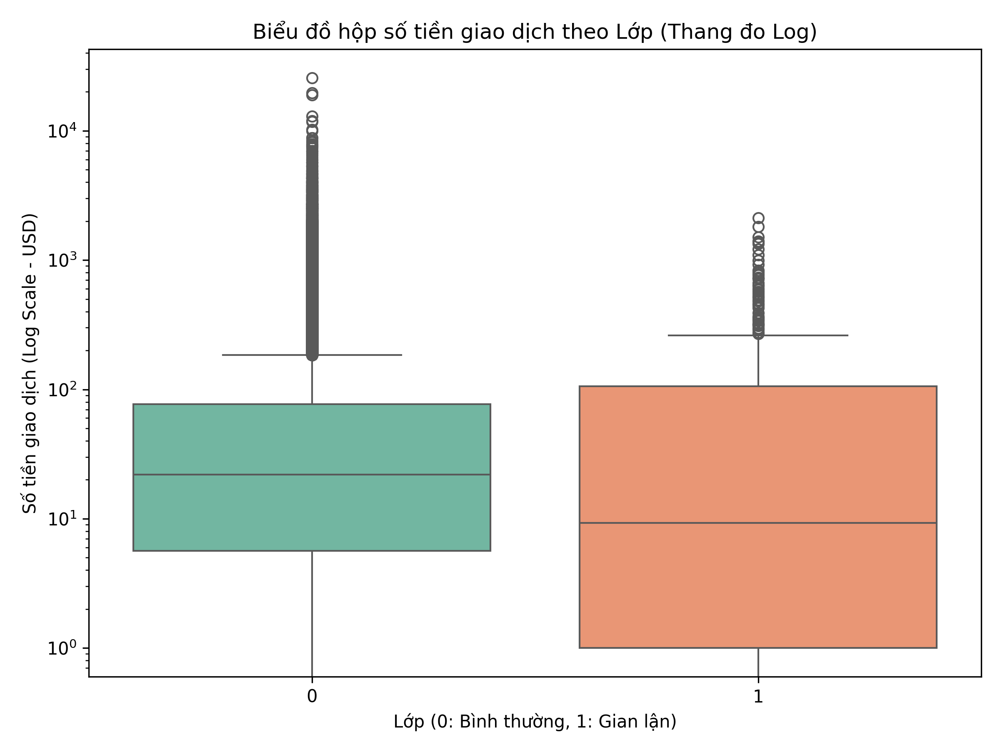
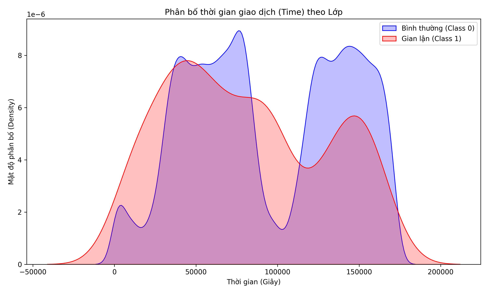
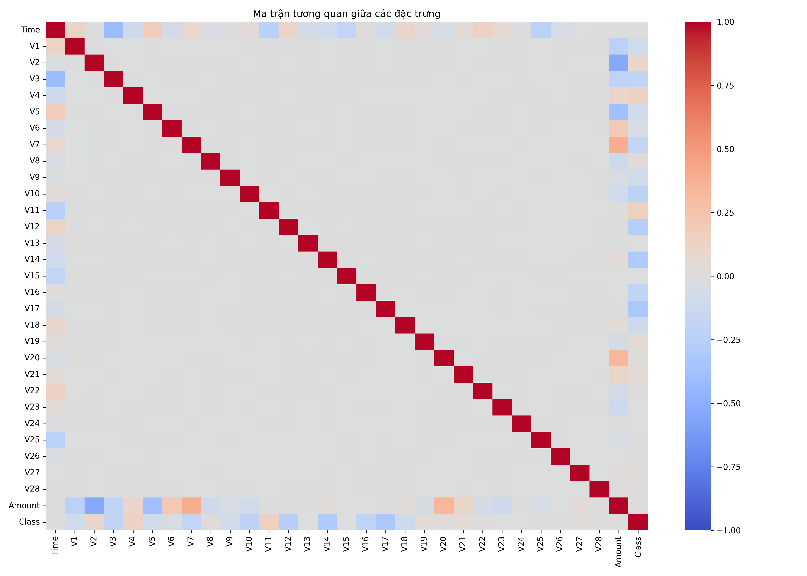
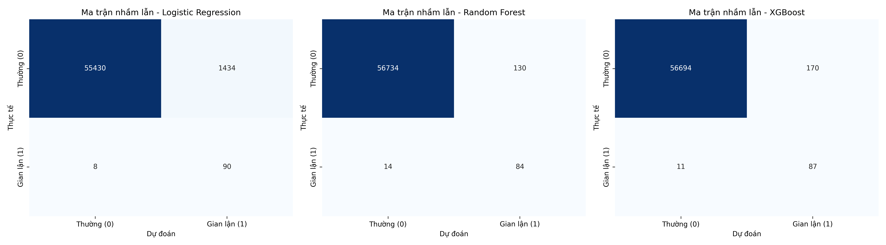

## 📋 Mục Lục

| # | Phần | Mô Tả |
|---|------|--------|
| 1 | Tổng Quan Dự Án | Vấn đề, mục tiêu và hướng tiếp cận |
| 2 | Quy Trình ML | Sơ đồ workflow từ đầu đến cuối |
| 3 | Cấu Trúc Dự Án | Bố cục thư mục và file |
| 4 | Bộ Dữ Liệu | Nguồn dữ liệu, đặc trưng và tải xuống |
| 5 | Cài Đặt Môi Trường | Hướng dẫn cài đặt và yêu cầu |
| 6 | Cách Chạy | Hướng dẫn thực thi từng bước |
| 7 | Bước 1 — Khám Phá Dữ Liệu | Phân tích dữ liệu ban đầu (EDA) |
| 8 | Bước 2 — Phân Tích Mô Tả | Insights ở cấp độ đặc trưng |
| 9 | Bước 3 — Tiền Xử Lý | Chuẩn hóa, chia tập, cân bằng dữ liệu |
| 10 | Bước 4 — Mô Hình Hóa | Huấn luyện và đánh giá mô hình |
| 11 | Bước 5 — Nộp Kết Quả | Tạo file đầu ra cuối cùng |
| 12 | Kết Quả & Đánh Giá | So sánh đầy đủ các chỉ số |
| 13 | Phát Hiện Chính | Những gì dữ liệu cho thấy |
| 14 | Hạn Chế | Đánh giá trung thực về các điểm yếu |
| 15 | Hướng Phát Triển | Lộ trình cải thiện |
| 16 | Tài Liệu Tham Khảo | Nguồn dữ liệu và trích dẫn |

# 1. Tổng quan dự án
dự án này được đặt tên là dự án creditcard fraud detection. Đây là Dự án  xây dựng một hệ thống học máy (Machine Learning) toàn diện nhằm phát hiện các giao dịch gian lận thẻ tín dụng. Bộ dữ liệu được sử dụng chứa các giao dịch được thực hiện bằng thẻ tín dụng vào tháng 9 năm 2013 bởi các chủ thẻ châu Âu. Bộ dữ liệu này bị mất cân bằng lớp cực kỳ nghiêm trọng, đòi hỏi các kỹ thuật tiền xử lý và mô hình hóa đặc thù.

## 🤖 Hướng Tiếp Cận

Dự án này tiếp cận bài toán phát hiện gian lận như một bài toán **phân loại nhị phân** sử dụng Machine Learning có giám sát:

| Lớp | Nhãn | Ý Nghĩa |
|-----|------|---------|
| Hợp lệ | 0 | Giao dịch bình thường |
| Gian lận | 1 | Giao dịch đáng ngờ |

### ⚠️ Thách Thức Cốt Lõi: Mất Cân Bằng Dữ Liệu Nghiêm Trọng

Bộ dữ liệu chứa **284.807 giao dịch**, trong đó chỉ có **492 giao dịch (0,17%)** là gian lận. Một mô hình đơn giản luôn dự đoán "không gian lận" sẽ đạt độ chính xác **99,83%** nhưng **không phát hiện được bất kỳ giao dịch gian lận nào** — điều này khiến độ chính xác (accuracy) trở thành một chỉ số hoàn toàn gây hiểu lầm trong bài toán này.

Dự án giải quyết vấn đề mất cân bằng dữ liệu bằng **SMOTE** và đánh giá mô hình dựa trên **Recall, Precision, F1-Score và ROC-AUC** thay vì accuracy.


Dự án phát hiện giao dịch thẻ tín dụng gian lận sử dụng các thuật toán Machine Learning. 
Dataset sử dụng: [Credit Card Fraud Detection - Kaggle](https://www.kaggle.com/datasets/mlg-ulb/creditcardfraud),  
gồm **284,807 giao dịch** với **492 giao dịch gian lận (0.17%)**
---

## 📌 Bộ dữ liệu (Dataset)
Do giới hạn dung lượng tệp tin của GitHub (<100MB), tệp dữ liệu gốc `creditcard.csv` (150MB) không được đẩy lên kho lưu trữ này. 
- Bạn có thể tải bộ dữ liệu trực tiếp từ liên kết: [GeeksforGeeks creditcard.csv](https://media.geeksforgeeks.org/wp-content/uploads/20240904104950/creditcard.csv)
- Sau khi tải về, hãy đặt tệp tin `creditcard.csv` vào thư mục gốc của dự án.

---

## 📂 Cấu trúc thư mục dự án
Dự án được chia thành các bước rõ ràng thông qua các tệp tin mã nguồn (có cả bản tiếng Việt có dấu và bản không dấu để tránh lỗi mã hóa trên Windows PowerShell):

## Bước 1: Khám phá và phân tích dữ liệu ban đầu (EDA)**
   - Mã nguồn: `buoc_1.py` hoặc `Bước 1 Khám phá và phân tích dữ liệu ban đầu (EDA).py`
   - Nhiệm vụ: Đọc dữ liệu, kiểm tra cấu trúc, tìm giá trị khuyết thiếu và phân tích sự mất cân bằng giữa giao dịch bình thường (Class 0) và gian lận (Class 1).
   - Biểu đồ đầu ra: `class_distribution.png` (Biểu thị tỷ lệ mất cân bằng lớp).
    - Kết quả biểu đồ class distribution:
      

     ## 📊 Nhận xét quan trọng
  

      Biểu đồ trên cho thấy dữ liệu đang bị mất câng bằng nghiêm trọng, cần phải thực hiện phương SMOTE để cân bằng lại dữ liệu giữa nhóm khách hàng uy tín và gian lận

## Bước 2: Phân tích mô tả chi tiết (Descriptive Analysis)**
   - Mã nguồn: `buoc_2.py` hoặc `Bước 2 Phân tích mô tả chi tiết (Descriptive Analysis).py`
   - Nhiệm vụ: Thống kê mô tả chi tiết thuộc tính số tiền giao dịch (`Amount`), phân bố thời gian giao dịch (`Time`), và vẽ ma trận tương quan giữa tất cả các đặc trưng.
    - Biểu đồ đầu ra: `amount_distribution.png` (Box plot số tiền), `time_distribution.png` (KDE plot thời gian), `correlation_matrix.png` (Heatmap ma trận tương quan).

## 📊 Nhận xét Biểu đồ Phân phối Số tiền Giao dịch



**Nhận xét:**

**Lớp 0 - Bình thường (xanh/Set2):**
- Trung vị khoảng **~20 USD** — giao dịch bình thường thường có giá trị nhỏ.
- Phân phối tập trung, hộp hẹp → số tiền khá đồng đều.
- Có nhiều điểm ngoại lệ (outliers) lên đến **~10,000 USD**.

**Lớp 1 - Gian lận (cam/Set2):**
- Trung vị khoảng **~10 USD** — thấp hơn giao dịch bình thường.
- Hộp rộng hơn nhiều → số tiền giao dịch gian lận biến động lớn hơn, trải từ **~1 USD** đến **~300 USD**.
- Ít outliers hơn lớp 0.

> 💡 **Kết luận quan trọng:** Trái với suy nghĩ thông thường, giao dịch gian lận không nhất thiết có số tiền lớn — thậm chí trung vị còn thấp hơn giao dịch bình thường. Kẻ gian lận thường thực hiện nhiều giao dịch nhỏ để tránh bị phát hiện!

## 📊 Nhận xét Biểu đồ Phân bố Thời gian Giao dịch



## Nhận xét (Insights):

- Hiện tượng: Phân phối của giao dịch hợp lệ (Normal) có tính chu kỳ với 2 đỉnh rõ rệt (tương ứng với khung giờ hoạt động cao điểm trong ngày). Ngược lại, giao dịch gian lận (Fraud) phân bổ rải rác hơn, không tuân theo chu kỳ này.

- Điểm nhấn: Tại các "vùng trũng" (thấp điểm) của giao dịch hợp lệ (như mốc 100k giây - khoảng 3h-4h sáng), tỷ trọng giao dịch gian lận vẫn duy trì, thậm chí tập trung cao hơn.

* Kết luận: Time là một feature có giá trị vì nó cho thấy kẻ gian hoạt động bất chấp nhịp sinh học của người dùng.

## 📊 Nhận xét Ma trận Tương quan (Correlation Matrix)



**Nhận xét:**
- Các đặc trưng **V1–V28** hầu như **không tương quan với nhau** (màu xám) 
→ đây là kết quả của PCA, các đặc trưng đã được tách biệt độc lập
- Đường chéo màu đỏ đậm = mỗi đặc trưng tương quan hoàn toàn với chính nó (= 1.0) — bình thường
- Cột **Class** (nhãn gian lận) có tương quan nhẹ với một số đặc trưng:
  - **V4, V11** tương quan dương nhẹ với Class (màu đỏ nhạt)
  - **V12, V14, V17** tương quan âm nhẹ với Class (màu xanh nhạt)
- **Amount** và **Time** gần như không tương quan với Class

> 💡 **Kết luận:** Không có đặc trưng đơn lẻ nào đủ mạnh để phân biệt gian lận, 
> các mô hình Machine Learning cần kết hợp nhiều đặc trưng cùng lúc mới cho kết quả tốt.
## Bước 3: Tiền xử lý dữ liệu (Data Preprocessing)**
   - Mã nguồn: `buoc_3.py` hoặc `Bước 3 Tiền xử lý dữ liệu (Data Preprocessing).py`
   - Nhiệm vụ: Chuẩn hóa dữ liệu bằng `RobustScaler` (chống chịu tốt với ngoại trị), phân chia tập Train/Test theo tỷ lệ 80/20, áp dụng thuật toán **SMOTE** (Oversampling) để cân bằng tập huấn luyện từ 394 mẫu gian lận lên 227,451 mẫu.

    ## 📊 Kết quả Tiền xử lý & Áp dụng SMOTE

**Sau khi áp dụng SMOTE:**

| Tập dữ liệu | Kích thước | Ghi chú |
|-------------|-----------|---------|
| Train đặc trưng (X_train_res) | (454,902 × 30) | Sau SMOTE |
| Train nhãn (y_train_res) | (454,902,) | 227,451 Bình thường vs 227,451 Gian lận |
| Test đặc trưng (X_test) | (56,962 × 30) | Giữ nguyên, không SMOTE |
| Test nhãn (y_test) | (56,962,) | Phân phối gốc |

**Nhận xét:**
- Trước SMOTE: dữ liệu gian lận chỉ chiếm **0.17%** → mô hình rất khó học
- Sau SMOTE: tập Train được cân bằng hoàn toàn **50/50** 
→ mô hình có đủ mẫu gian lận để học hiệu quả
- Tập Test **giữ nguyên phân phối gốc** để đánh giá mô hình sát với thực tế nhất

> 💡 **Lưu ý quan trọng:** SMOTE chỉ được áp dụng trên tập Train, 
> **không áp dụng trên tập Test** để tránh làm sai lệch kết quả đánh giá!

## Bước 4: Huấn luyện và Đánh giá Mô hình**
   - Mã nguồn: `buoc_4.py` hoặc `Bước 4 Huấn luyện và Đánh giá Mô hình.py`
   - Nhiệm vụ: Huấn luyện 3 mô hình phân loại: **Logistic Regression**, **Random Forest Classifier**, và **XGBoost Classifier**. Thực hiện dự đoán trên tập kiểm thử (giữ nguyên tỷ lệ mất cân bằng thực tế) và so sánh hiệu năng.
   - Biểu đồ đầu ra: `confusion_matrices.png` (Ma trận nhầm lẫn của cả 3 mô hình).


## Bước 5: Kết quả dự đoán (Submission)**
   - Mã nguồn: `buoc_5_submission.py` hoặc `Bước 5 Tạo kết quả dự đoán (Submission).py`
   - Nhiệm vụ: Huấn luyện mô hình đề xuất **Logistic Regression** (sử dụng SMOTE) và thực hiện dự đoán nhãn lớp cũng như xác suất gian lận (probability) cho tập kiểm thử (Test set - 20% dữ liệu gốc).
   - Kết quả đầu ra: Tệp dữ liệu kết quả dự đoán [submission_logistic_regression.csv]

Kết quả confusion matrix:

---
## 📊 Nhận xét Ma trận Nhầm lẫn (Confusion Matrix)

| | Logistic Regression | Random Forest | XGBoost |
|--|--|--|--|
| Dự đoán đúng bình thường (TN) | 55,430 | 56,734 | 56,694 |
| Báo nhầm gian lận (FP) | 1,434 | 130 | 170 |
| Bỏ sót gian lận (FN) | 8 | 14 | 11 |
| Bắt đúng gian lận (TP) | 90 | 84 | 87 |

**💡 Nhận xét:**

- **Logistic Regression** bắt được nhiều gian lận nhất **(90/98)** nhưng báo nhầm rất nhiều
(1,434 giao dịch bình thường bị nghi oan) — gây phiền hà cho khách hàng
- **Random Forest** báo nhầm ít nhất **(130 FP)** nhưng bỏ sót nhiều gian lận hơn (14 giao dịch)
- **XGBoost** cân bằng tốt nhất — bắt được **87/98** giao dịch gian lận, 
chỉ báo nhầm 170 trường hợp

> ⚠️ Trong thực tế, **bỏ sót gian lận (FN) nguy hiểm hơn báo nhầm (FP)**.  
> Do đó **Logistic Regression** vẫn là lựa chọn an toàn nhất dù Precision thấp.

## 📈 Kết quả huấn luyện và So sánh mô hình
Dưới đây là bảng so sánh hiệu năng của các mô hình (được xếp thứ tự theo độ nhạy **Recall** lớp 1):

| Mô hình (Model) | Accuracy | Precision (Lớp 1) | Recall (Lớp 1) | F1-Score (Lớp 1) | Số giao dịch gian lận bắt được |
| :--- | :--- | :--- | :--- | :--- | :--- |
| **Logistic Regression** | 97.47% | 5.91% | **91.84%** | 11.10% | **90 / 98** |
| **XGBoost** | 99.68% | 33.85% | **88.78%** | 49.01% | **87 / 98** |
| **Random Forest** | 99.75% | **39.25%** | **85.71%** | **53.85%** | **84 / 98** |

### Nhận xét quan trọng:
- **Logistic Regression** đạt Recall cao nhất (91.84%) nhưng Precision vô cùng thấp (5.91%), tạo ra quá nhiều báo động giả (False Positives), gây phiền hà cho khách hàng trong thế giới thực.
- **XGBoost** là mô hình có sự cân bằng tối ưu nhất cho bài toán này, đạt Recall **88.78%** và Precision tăng vượt bậc lên **33.85%** (F1-score 49.01%).
- **Random Forest** cho số lượng báo động giả ít nhất với Precision cao nhất là **39.25%**, tuy nhiên bỏ sót nhiều giao dịch gian lận hơn (Recall 85.71%).
> ⚠️ **Lưu ý:** Trong bài toán phát hiện gian lận, **bỏ sót giao dịch gian lận (False Negative) nguy hiểm hơn báo nhầm (False Positive)**. Do đó, **Logistic Regression** là lựa chọn phù hợp nhất cho môi trường thực tế.
## 🎯 Kết luận

Qua quá trình thử nghiệm 3 mô hình trên bộ dữ liệu mất cân bằng nghiêm trọng (0.17% gian lận), kết quả cho thấy:

- Không có mô hình nào hoàn hảo — mỗi mô hình có sự đánh đổi riêng giữa Recall và Precision, lựa chọn chỉ số nào nên dùng phụ thuộc và yêu cầu của dự án
- Kỹ thuật **SMOTE** giúp cải thiện đáng kể khả năng phát hiện gian lận so với không xử lý mất cân bằng
- Dựa trên bố cảnh và yêu cầu của bài toán,chỉ số recall sẽ là chỉ số quan trọng nhất trong việc xác định và hạn chế bỏ sót khách hàng gian lận. phương pháp **Logistic Regression** được khuyến nghị cho môi trường thực tế vì bỏ sót ít giao dịch gian lận nhất (90/98) với chỉ số recall cao nhất 91,84%

> Hướng phát triển tiếp theo: Tinh chỉnh ngưỡng phân loại (threshold tuning) và kết hợp các mô hình (Ensemble) để cải thiện cả Recall lẫn Precision cùng lúc.
```
---

## 🛠️ Hướng dẫn cài đặt và Chạy dự án

### 1. Cài đặt các thư viện cần thiết
Đảm bảo bạn đã cài đặt Python. Cài đặt các thư viện phụ thuộc bằng lệnh sau:
```bash
pip install pandas numpy matplotlib seaborn scikit-learn imbalanced-learn xgboost
```

### 2. Chạy lần lượt các bước
Để chạy các đoạn mã trong môi trường Windows PowerShell, vui lòng thiết lập bảng mã UTF-8 bằng cách thêm tiền tố lệnh:

- **Chạy Bước 1 (EDA ban đầu)**:
  ```powershell
  $env:PYTHONIOENCODING='utf-8'; python buoc_1.py
  ```
- **Chạy Bước 2 (Phân tích chi tiết)**:
  ```powershell
  $env:PYTHONIOENCODING='utf-8'; python buoc_2.py
  ```
- **Chạy Bước 3 (Tiền xử lý & SMOTE)**:
  ```powershell
  $env:PYTHONIOENCODING='utf-8'; python buoc_3.py
  ```
- **Chạy Bước 4 (Huấn luyện & Đánh giá)**:
  ```powershell
  $env:PYTHONIOENCODING='utf-8'; python buoc_4.py
  ```
- **Chạy Bước 5 (Tạo kết quả dự đoán - Submission)**:
  ```powershell
  $env:PYTHONIOENCODING='utf-8'; python buoc_5_submission.py
  ```

---

## 🤝 Đóng góp
Nếu bạn có bất kỳ đề xuất cải tiến nào về mô hình (như Hyperparameter Tuning hoặc Grid Search), hãy tạo Pull Request hoặc Issues trên repo này!
